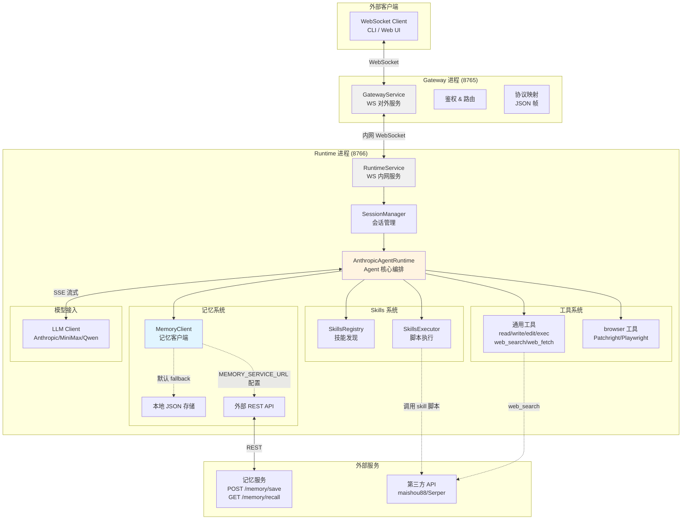
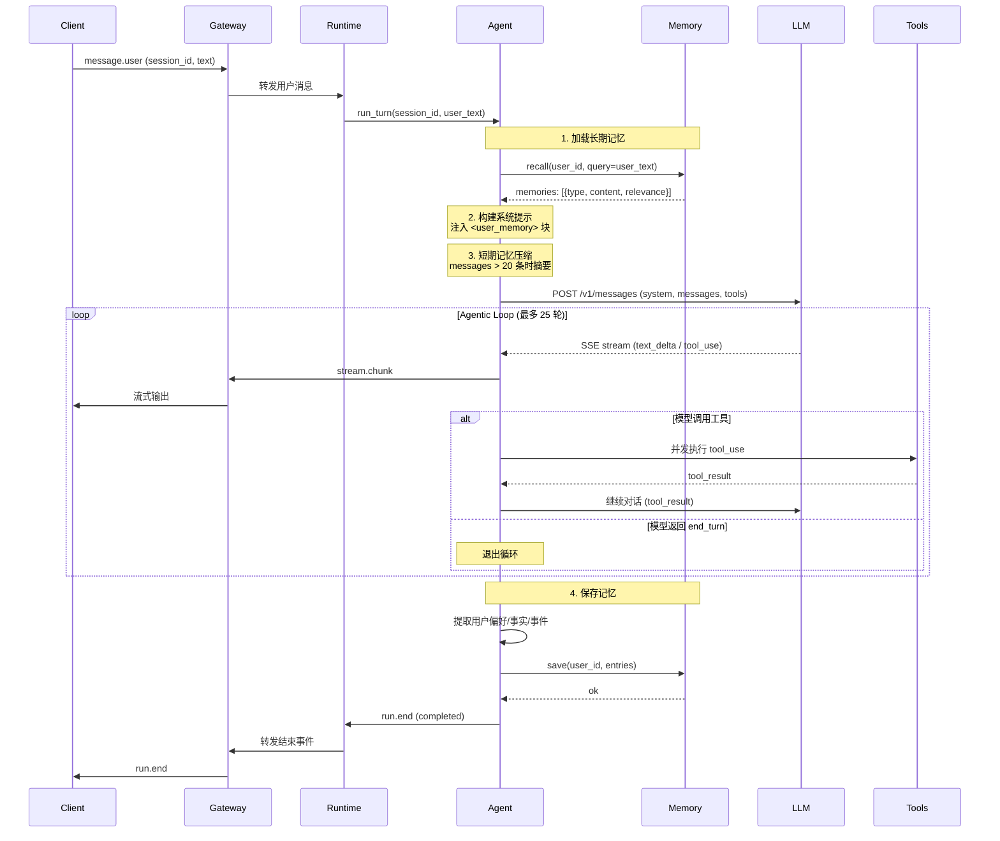
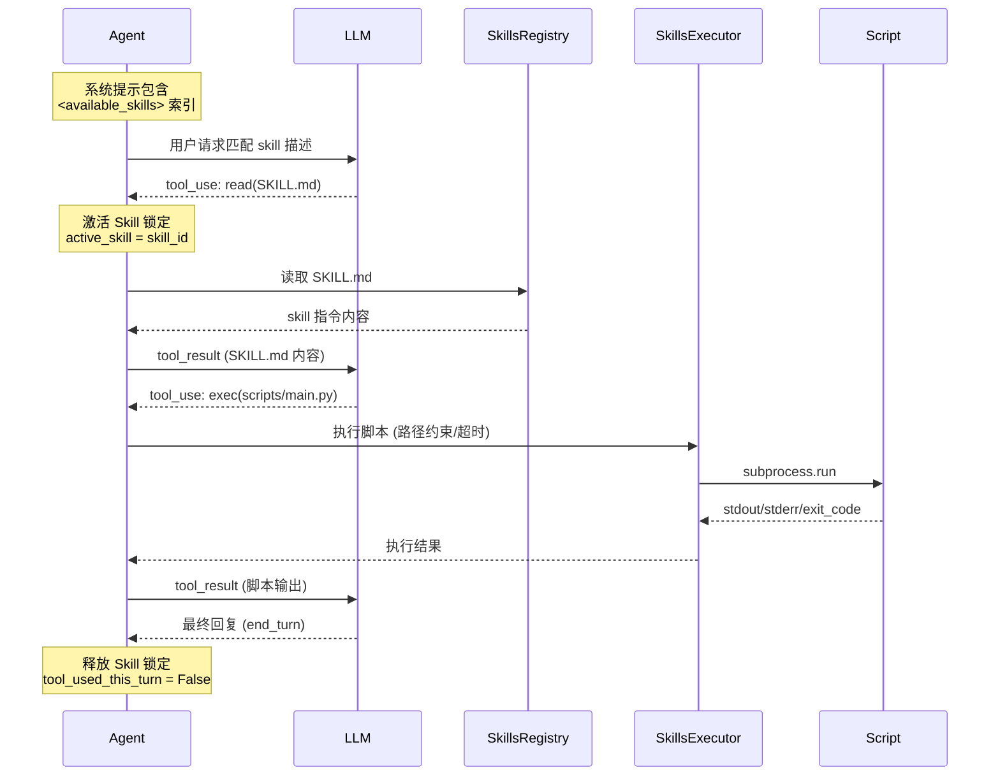
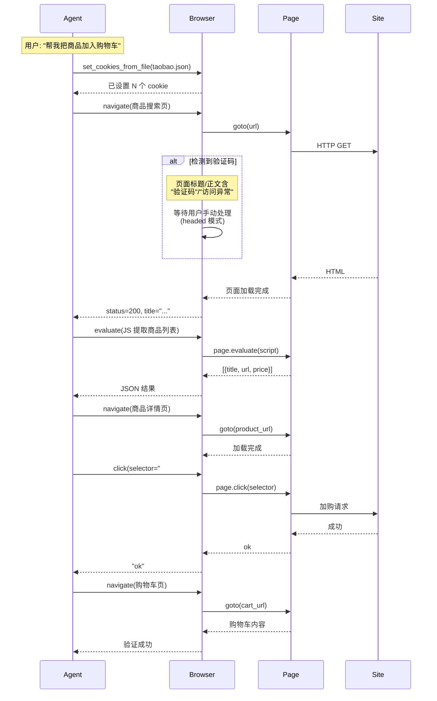
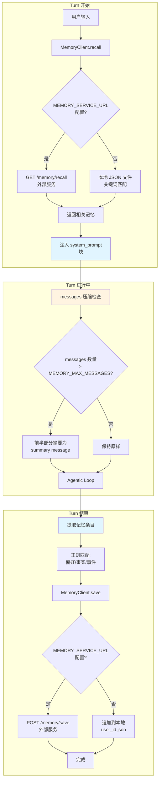
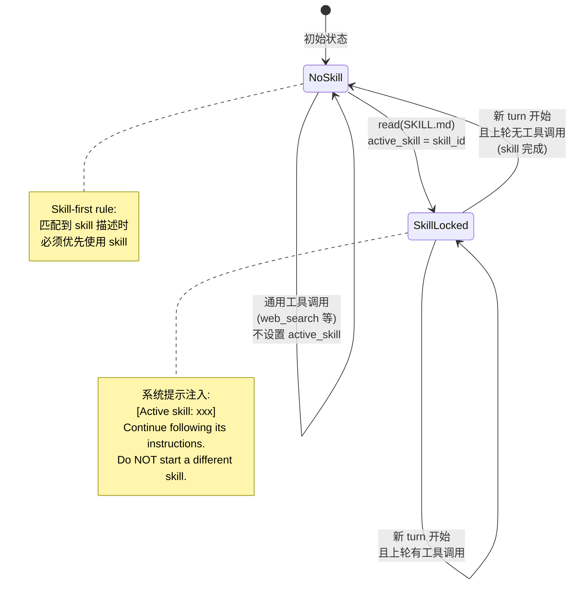
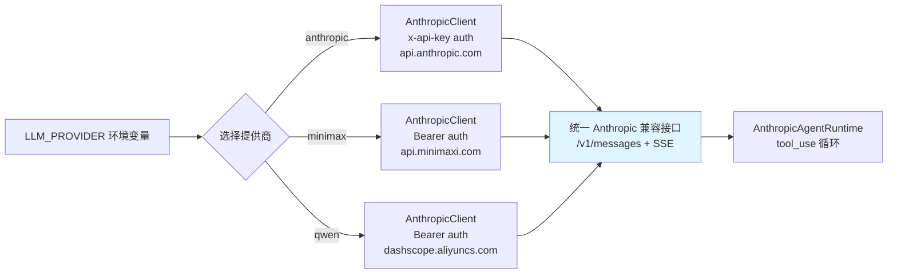
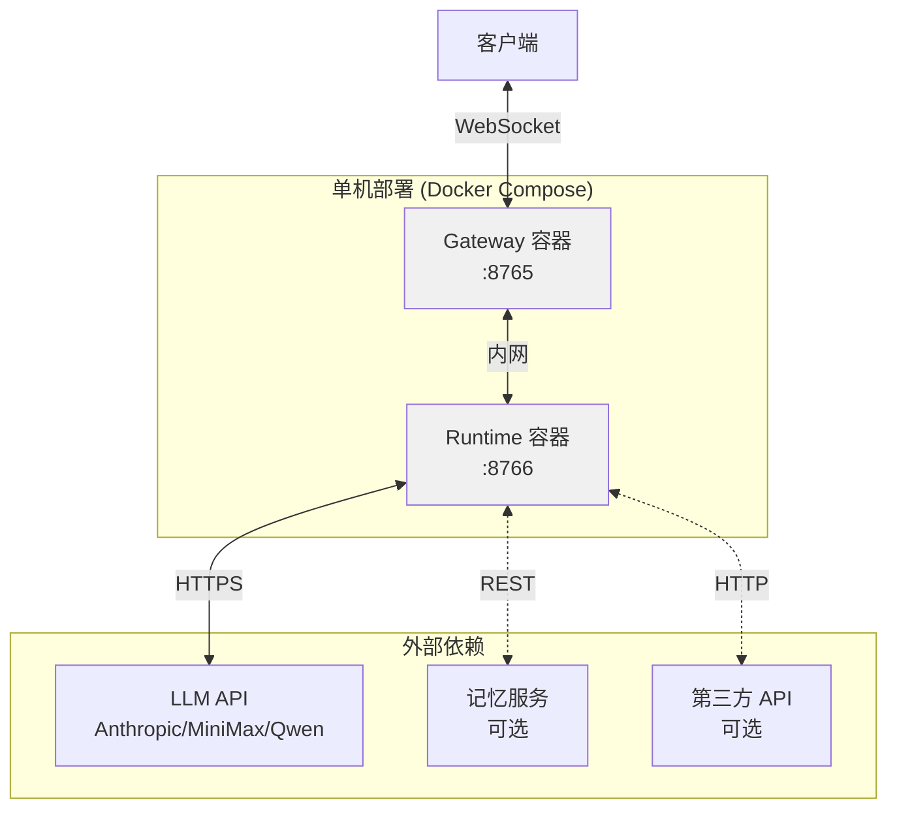

# runTime 项目架构与流程图

## 整体架构

## 单次对话流程（含记忆）

## Skills 执行流程

## 浏览器工具流程（电商场景）

## 记忆系统详细流程

## 跨轮次 Skill 锁定机制

## 多 LLM 提供商切换

## 部署架构

## 配置项总览

| 类别 | 环境变量 | 说明 |
|------|----------|------|
| **模型** | `LLM_PROVIDER` | anthropic / minimax / qwen |
| | `ANTHROPIC_API_KEY` | Anthropic API 密钥 |
| | `MINIMAX_API_KEY` | MiniMax API 密钥 |
| | `QWEN_API_KEY` | Qwen API 密钥 |
| **Skills** | `SKILLS_PATHS` | 额外 skills 目录 (分号分隔) |
| | `SKILLS_MAX_PROMPT_CHARS` | 提示词字符预算 (默认 30000) |
| | `SKILLS_MAX_IN_PROMPT` | 最多包含 skill 数 (默认 150) |
| **浏览器** | `BROWSER_HEADLESS` | true/false (默认 true) |
| | `BROWSER_TIMEOUT_S` | 页面操作超时 (默认 30) |
| | `BROWSER_USER_DATA_DIR` | 持久化数据目录 |
| | `TAOBAO_COOKIE_FILE` | 淘宝 cookie 文件路径 |
| **记忆** | `MEMORY_SERVICE_URL` | 外部记忆服务地址 |
| | `MEMORY_LOCAL_DIR` | 本地存储目录 |
| | `MEMORY_MAX_MESSAGES` | 消息压缩阈值 (默认 20) |
| | `MEMORY_RECALL_LIMIT` | 检索记忆条数 (默认 10) |
| **工具** | `PRICE_COMPARE_SERVICE_URL` | 比价服务地址 |
| | `SERPER_API_KEY` | Serper 搜索 API |
| **运维** | `LOG_LEVEL` | 日志级别 (默认 INFO) |
| | `MAX_TOOL_ROUNDS` | 工具循环上限 (默认 25) |
| | `EXTRA_WORKSPACE_DIRS` | 额外工作目录 |
| | `EXTRA_PATH` | 额外 PATH 目录 |

---

*生成时间: 2026-04-13*
*项目版本: openclaw-gateway-runtime (45/46 tasks complete - 新增记忆系统)*
