# runTime 智能通话助理 软件实现设计文档

---

## 1 简介

### 1.1 目的

本文档描述 runTime 智能通话助理系统的软件实现设计，包括系统架构、功能模块、接口定义和非功能性需求。作为开发实施和系统集成的技术依据。

### 1.2 范围

本系统是一个基于 Python 3.11+ asyncio 的 Gateway/Runtime 分层架构通话助理，面向以下场景：
- 电话通话语音交互（ASR/TTS 由媒体端完成）
- 商品比价与购物助手（Skill 引擎驱动）
- 实时视频理解与视觉辅助（双模型协作）
- 跨会话长期记忆（外部记忆服务）
- 多用户并发接入与会话管理

### 1.3 术语及缩略语

| 术语/缩略语 | 说明 |
|---|---|
| Gateway | 网关服务，负责外部 WebSocket 连接管理、多用户路由 |
| Runtime | 运行时服务，负责 Agent 逻辑执行、LLM 调用、Skill 编排 |
| LLM | 大语言模型（Large Language Model） |
| Skill | 技能模块，含 SKILL.md 定义的可执行任务 |
| Frame | WebSocket 传输的 JSON 消息单元 |
| Tool Loop | LLM 多轮工具调用循环 |
| TTS | 文字转语音（Text-to-Speech） |
| ASR | 语音识别（Automatic Speech Recognition） |
| VisionClient | 视觉理解客户端，对接多模态视觉模型 |
| MemoryPlugin | 记忆服务插件抽象接口 |
| Engine | 确定性 Skill 步骤执行引擎 |
| expects_reply | 标记对话是否需要用户回复的协议字段 |
| FrameBuffer | 视频帧环形缓冲区 |

### 1.4 假设和约束

**假设：**
- 媒体端负责 ASR（语音转文字）和 TTS（文字转语音），服务端只处理文字
- 客户端通过 WebSocket 连接，支持持续推送视频帧（1FPS JPEG）
- LLM 提供商 API 可用且响应延迟 < 5s
- 外部记忆服务独立部署，通过 REST API 对接

**约束：**
- 通话场景要求端到端延迟 < 3s（文字响应）
- 单服务实例最大并发用户数 20（可配置）
- 视频帧压缩到 480p / < 60KB
- LLM 提供商限于国内可访问服务（Qwen、MiniMax）

### 1.5 价值

- **用户价值**：语音交互自然流畅，支持商品比价、购物下单、视觉识别等多场景
- **技术价值**：Gateway/Runtime 分离架构解耦，Skill 引擎确定性执行减少 LLM 开销，插件化记忆和视觉模块可扩展
- **商业价值**：多 LLM 提供商可切换降低成本，支持多用户并发服务

---

## 2 需求分析

### 2.1 通话助理核心功能

系统作为电话通话中的智能助理，通过语音与用户交互，提供商品搜索、比价、加购等购物服务，并支持视频画面理解和长期记忆。

#### 2.1.1 正常场景

| 场景 | 描述 |
|------|------|
| 语音对话 | 用户语音→ASR→文字→Agent→回复文字→TTS→语音 |
| 商品比价 | 用户说"帮我搜华为Mate70 Pro"→确认→搜索→展示结果（含链接+图片） |
| 加购物车 | 用户选定商品→通过浏览器自动化添加到京东购物车 |
| 视觉理解 | 用户对着画面问"这是什么"→视觉模型识别→文字模型回复 |
| 搜同款 | 基于视觉识别结果→调用比价 Skill 搜索 |
| 实时信息查询 | 用户问天气/新闻→web_search 工具获取实时信息 |
| 跨会话记忆 | 用户说"上次那个手机"→从记忆服务检索历史 |

#### 2.1.2 异常场景

| 场景 | 描述 | 处理方式 |
|------|------|----------|
| LLM 超时 | API 响应超过 120s | 超时中断，返回空响应兜底提示 |
| LLM 空响应 | 模型返回 stop_reason=null | 回复"没反应过来，你再说一次？" |
| Skill 搜索失败 | API 临时错误 | 自动重试 1 次（间隔 1.5s） |
| 加购失败 | 京东登录过期 | 返回商品链接让用户自行购买 |
| 客户端异常断开 | WebSocket 无 close frame | 记录 connection_lost，清理资源 |
| 多连接竞争 | 同一用户多个连接 | evict 旧连接，新连接接管 |
| 用户打断 | 新消息打断正在执行的 run | cancel 当前 run，启动新 run |
| 视觉模型超时 | VisionClient > 2s | 跳过视觉上下文，纯文字处理 |
| 话题切换 | 用户中途换话题 | 释放 Skill 锁，end_turn(expects_reply=false) |

### 2.2 辅助功能

#### 2.2.1 流式响应 TTS 适配

系统的流式响应需要适配 TTS 逐句朗读，通过标签标记区分"朗读内容"和"仅显示内容"。

- 响应文字按标点分句（，。！？）发送，适配 TTS 逐句朗读
- `<detail>` 标签内容只显示不朗读（商品列表、价格表等）
- `<link>` 标签保留透传，客户端渲染为可点击链接
- `<pic>` 标签保留透传，客户端渲染为商品图片
- 流式 chunk 间隔 10ms 避免客户端堆积

#### 2.2.2 状态日志与监控

系统通过结构化 JSON 日志记录所有关键事件，便于监控、告警和问题排查。

- 结构化 JSON 日志（component/event/timestamp/level）
- 关键事件：connection_open/close、run_started/finished、llm_request/response、chunk_sent、engine_exec
- connection_close 标记 reason（normal/hangup/connection_lost）
- connection_lost 使用 error 级别，方便告警

---

## 3 组网分析

系统采用 Gateway/Runtime 双层架构，Gateway 负责对外连接管理和多用户路由，Runtime 负责 Agent 逻辑执行。两者通过进程内双向通道（InMemoryDuplex）通信，也可通过 WebSocket 进行跨进程部署。

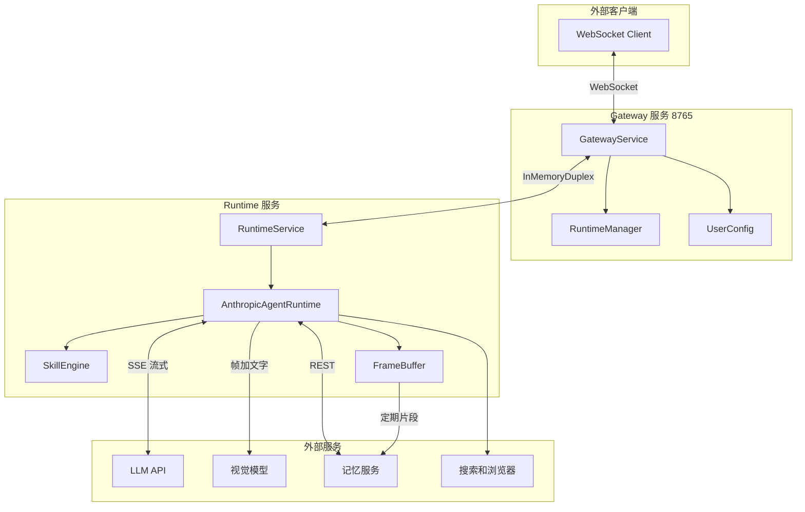

**网络接口：**
- Gateway 对外：WebSocket `0.0.0.0:8765`（可配置）
- Gateway ↔ Runtime：InMemoryDuplex（进程内，零延迟）
- Runtime → LLM：HTTPS（阿里云 dashscope / MiniMax API）
- Runtime → 视觉模型：HTTPS（qwen-vl-plus API）
- Runtime → 记忆服务：HTTP REST
- Runtime → 搜索：HTTPS（DuckDuckGo）
- Runtime → 浏览器：本地 Playwright/Patchright

---

## 4 功能性系统设计

### 4.1 Gateway 服务

Gateway 是系统的入口层，接受外部 WebSocket 连接，管理多用户路由，将消息转发到对应用户的 Runtime 实例。它不参与业务逻辑，只做帧转发、连接管理和异常处理。

核心职责包括：通话接入（call.incoming/call.ready）、帧转发、旧连接驱逐（evict）、流式节流（10ms）、断连处理。

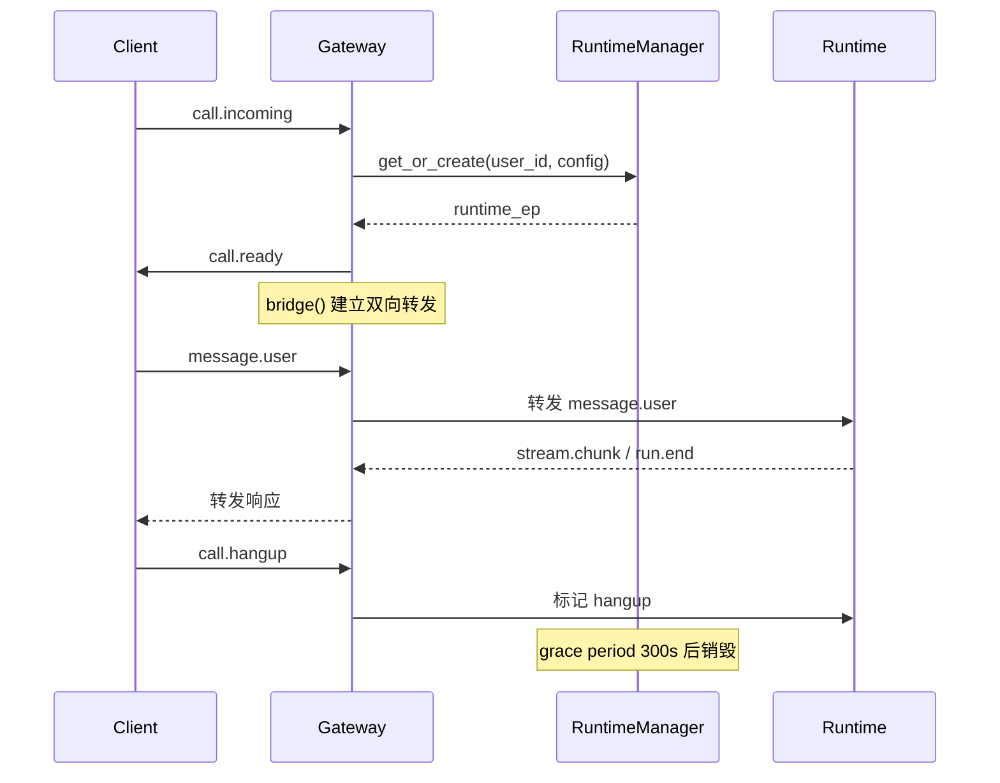

#### 4.1.1 通话接入正常流程

用户通过客户端发起通话连接，Gateway 创建或复用该用户的 RuntimeService 实例，建立双向消息桥接，进入对话循环。通话结束后进入 grace period，一段时间内用户回拨可复用会话上下文。

#### 4.1.2 异常场景

##### 4.1.2.1 客户端异常断开（connection_lost）

当客户端 TCP 连接中断（无 WebSocket close frame），Gateway 捕获 ConnectionClosedError，标记 reason 为 "connection_lost"，以 error 级别记录日志，并 cancel 该用户的活跃 run。

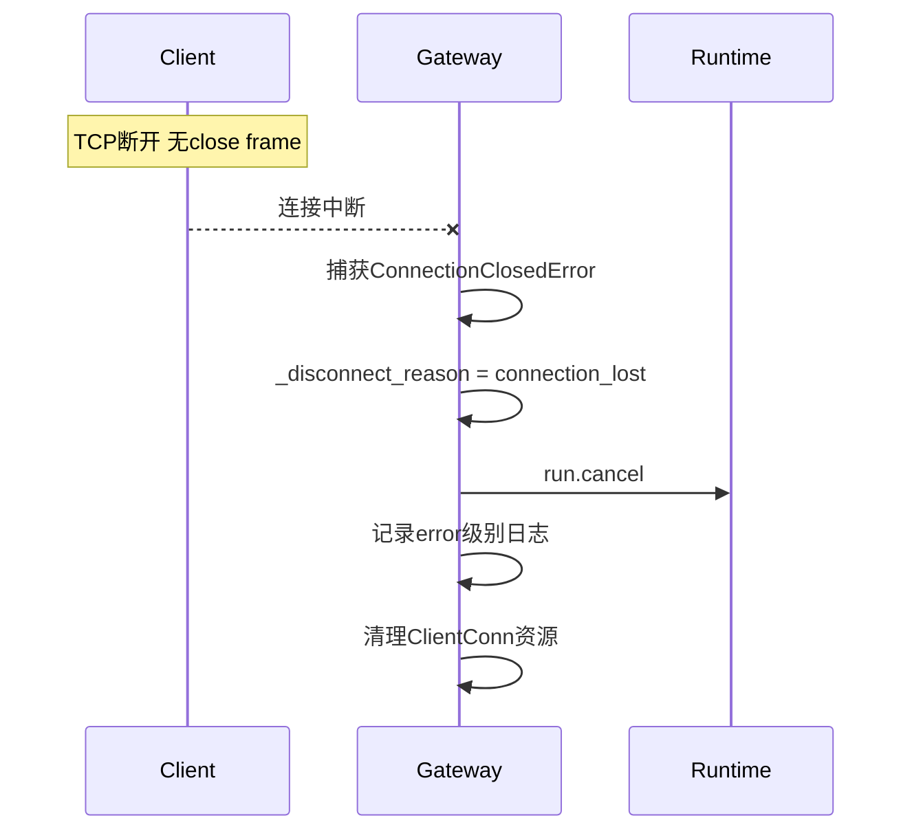

##### 4.1.2.2 同一用户多连接竞争（evict）

同一 user_id 有多个 WebSocket 连接时，新连接会驱逐旧连接。通过 cancel_event 通知旧 bridge 退出，注入 _evict 唤醒帧让旧 _runtime_to_client 从 queue.get() 中解除阻塞。旧 bridge 退出时不发 run.cancel，避免误杀新连接的 run。

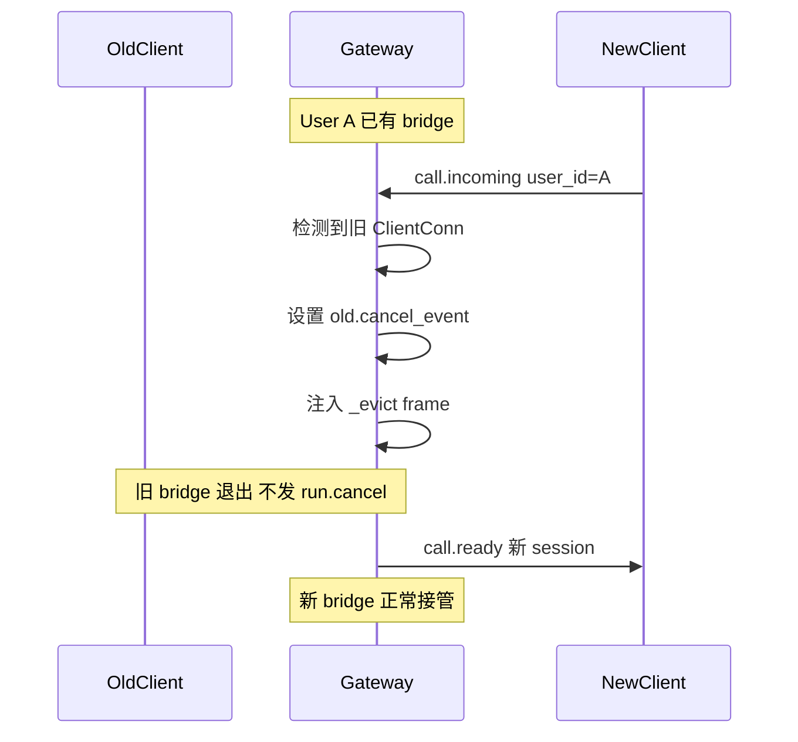

##### 4.1.2.3 用户消息打断当前执行

用户在 Agent 执行过程中发送新消息，系统自动中断当前 run 并启动新 run。通过 CancelToken（asyncio.Event）实现协作式取消。

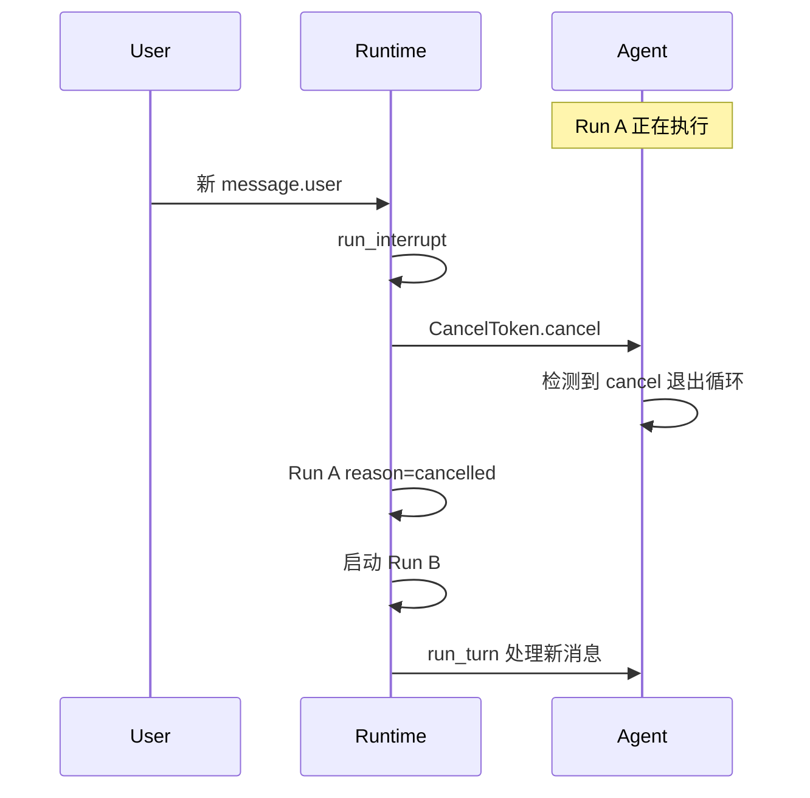

##### 4.1.2.4 LLM 响应超时

LLM API 调用超过 timeout_s（默认 120s）时，aiohttp 抛出 TimeoutError，run_turn 捕获异常并返回 run.end(reason=error)。

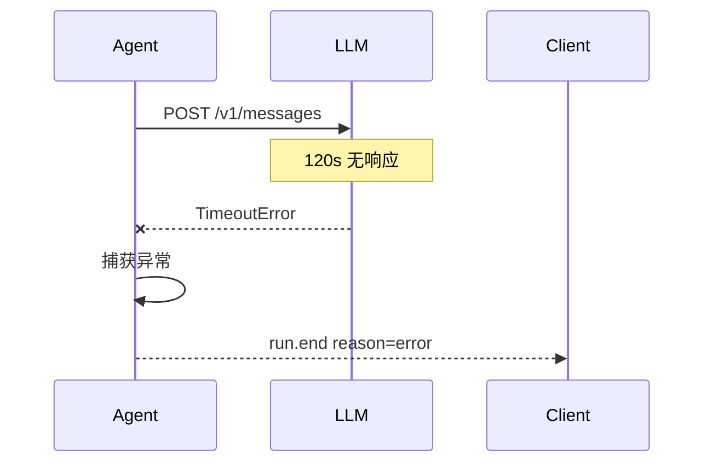

##### 4.1.2.5 LLM 空响应

当 LLM 返回 stop_reason=null 且无文字输出，系统自动回复兜底提示并设置 expects_reply=true，让用户有机会重新发起请求。

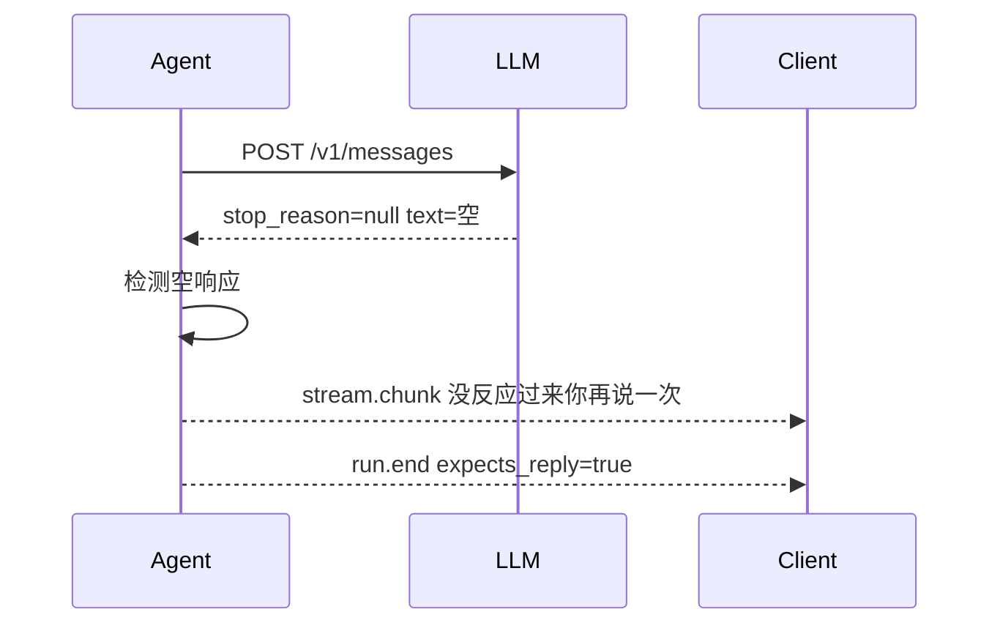

### 4.2 Runtime 服务

Runtime 是 Agent 逻辑的核心执行层，管理会话状态，驱动 LLM Tool Loop，编排 Skill 执行，集成视觉理解和记忆服务。每个用户拥有独立的 RuntimeService 实例。

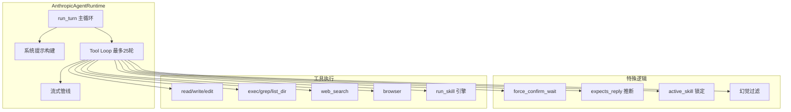

#### 4.2.1 比价搜索正常场景

用户表达购物意图后，系统先确认意图（"帮你搜X？"），用户确认后读取 SKILL.md，通过确定性引擎执行搜索步骤，获取商品数据（含链接和图片），直接发送 detail 给前端，LLM 做口语总结。

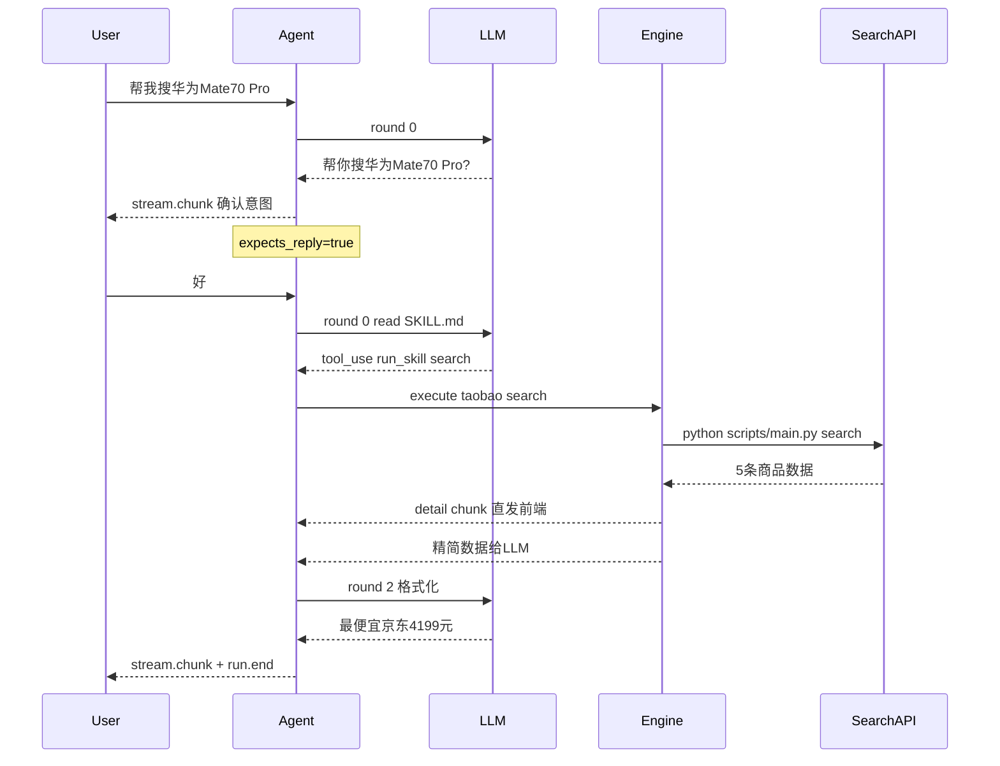

### 4.3 视觉理解系统

视觉理解采用双模型协作方式：文字模型（qwen-plus）主控对话和工具调用，视觉模型（qwen-vl-plus）负责画面理解。客户端持续推送视频帧（1FPS），服务端帧缓冲区保留最近 5 帧。当用户说话时，取最近 3 帧与用户文字一起发给视觉模型，返回画面描述后注入文字模型上下文。

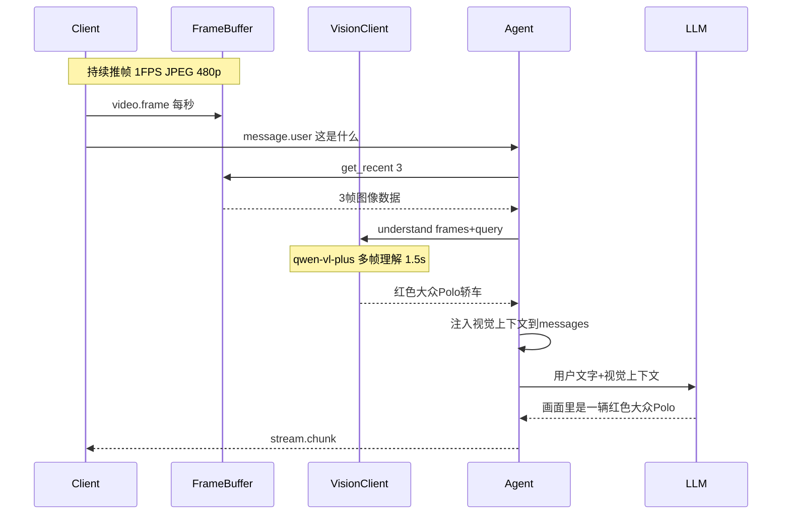

视觉描述注入对话历史后持久化在 session messages 中，后续用户说"帮我搜同款"时文字模型可从历史中检索。视觉模型超时（>2s）时自动跳过，不影响文字对话。

### 4.4 记忆系统

记忆系统为 Agent 提供跨会话的长期记忆能力。通过插件化接口对接外部记忆服务（Memory Server），支持对话历史存储、语义检索、视频片段上传等功能。

会话建立时从记忆服务获取用户近期历史（含视觉记忆），注入系统提示。视频帧数据定期合成为片段文件上传到记忆服务，由服务自行做关键帧提取和 embedding 存储。

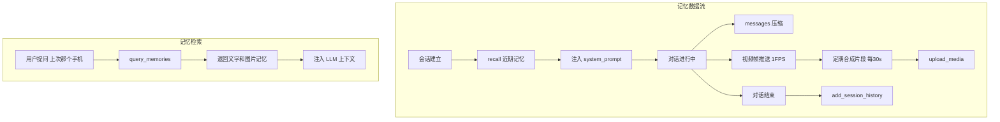

**记忆分层：**

| 范围 | 数据来源 | 检索方式 |
|------|----------|----------|
| 当前 session | 视觉描述在 messages 历史中 | 文字模型直接看到 |
| 跨 session | 记忆服务存储的帧+对话+元数据 | memory_client.recall() |

### 4.5 Skill 系统

Skill 是可热加载的技能模块，通过 SKILL.md 定义（YAML frontmatter + markdown body + Steps YAML）。系统支持两种执行模式：确定性引擎执行（Steps YAML 定义）和 LLM 驱动执行（无 Steps 时）。

Skills 动态发现：每次 run_turn 开始时 SkillsRegistry.refresh() 扫描 skills/ 目录，新放入的 Skill 无需重启即可使用。

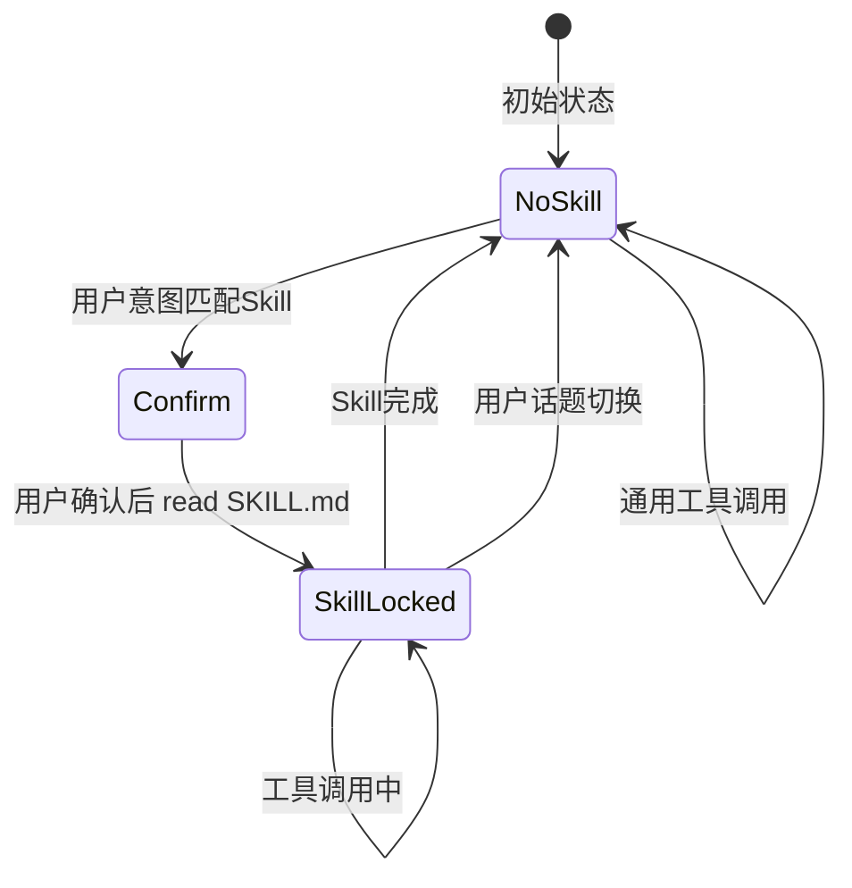

---

## 5 非功能性需求分析

### 5.1 可靠性分析

系统通过多层机制保证服务可靠性：进程保活、连接恢复、失败兜底和资源清理。

| 项目 | 设计 |
|------|------|
| 进程保活 | supervisord 管理 Gateway + Runtime，崩溃自动重启 |
| 连接断开恢复 | 同一 user 重新连接可复用 RuntimeService（grace period 300s） |
| LLM 失败兜底 | 空响应检测 + 用户友好提示 |
| Skill 重试 | exec 步骤内置 1 次自动重试 |
| 资源清理 | idle reaper 600s 超时销毁；hangup grace 300s |
| 异常日志 | connection_lost 标记 error 级别，方便告警 |

### 5.2 兼容性分析

系统设计上不绑定特定模型或客户端实现，通过配置切换适应不同环境。

| 项目 | 设计 |
|------|------|
| LLM 提供商 | 多 provider 可切换（Qwen/MiniMax），通过 .env 配置 |
| 模型版本 | 不绑定特定模型，通过 QWEN_MODEL 配置 |
| 协议版本 | Frame v=1，向后兼容 |
| Python 版本 | >= 3.11 |
| 操作系统 | Linux（Docker）/ Windows（开发） |
| 客户端 | 标准 WebSocket，无特殊依赖 |
| Prompt 语言 | 动态切换中英文（user_config.language） |

### 5.3 扩展性分析

系统各层均预留扩展点，支持新功能接入而不影响已有逻辑。

| 项目 | 设计 |
|------|------|
| Skills 动态加载 | SkillsRegistry.refresh() 每次 run_turn 自动扫描 |
| 新 Skill 接入 | 放入 skills/ 目录即可，无需改代码 |
| 新工具 | 在 _tools() 中注册即可 |
| 并发扩展 | MAX_RUNTIME_INSTANCES 可配置 |
| 新标签类型 | DetailTagParser._TAGS 列表可扩展 |
| 记忆服务 | MemoryPlugin 插件化接口，可替换实现 |
| 视觉模型 | VisionClient 抽象接口，可替换为 Realtime 长会话 |

---

## 6 接口设计

### 6.1 概述

所有客户端-服务端接口基于 WebSocket JSON Frame 协议。记忆服务接口基于 HTTP REST。Frame 基本结构：

```json
{
  "v": 1,
  "type": "<frame_type>",
  "session_id": "<uuid>",
  "turn_id": "<uuid>",
  "run_id": "<uuid>",
  "user_id": "<string>",
  "payload": {},
  "reason": "<string>",
  "error": {"code": "<string>", "message": "<string>"}
}
```

以下为各接口详细定义。

### 6.2 通话管理接口（Call）

#### 6.2.1 概述

通话管理接口处理客户端接入、会话建立和通话挂断。

#### 6.2.2 通话接入（call.incoming）

##### 6.2.2.1 接口定义

| 字段 | 类型 | 必填 | 说明 |
|------|------|------|------|
| type | string | 是 | `"call.incoming"` |
| user_id | string | 是 | 用户标识（电话号码） |
| payload.language | string | 否 | 语言（默认 "zh-CN"） |
| payload.agent_profile | string | 否 | Agent 配置（默认 "default"） |
| payload.tone | string | 否 | 语气风格（默认 "friendly"） |
| payload.user_info | string | 否 | 用户附加信息 |

##### 6.2.2.2 请求示例

```json
{
  "v": 1,
  "type": "call.incoming",
  "user_id": "008613800138000",
  "payload": {
    "language": "zh-CN",
    "agent_profile": "default",
    "tone": "friendly"
  }
}
```

##### 6.2.2.3 响应示例（call.ready）

```json
{
  "v": 1,
  "type": "call.ready",
  "user_id": "008613800138000",
  "session_id": "a1b2c3d4-e5f6-7890-abcd-ef1234567890"
}
```

#### 6.2.3 通话挂断（call.hangup / call.hangup_ack）

```json
// 请求
{"v": 1, "type": "call.hangup", "user_id": "008613800138000", "session_id": "a1b2c3d4"}
// 响应
{"v": 1, "type": "call.hangup_ack", "user_id": "008613800138000"}
```

### 6.3 消息接口（Message）

#### 6.3.1 用户消息（message.user）

| 字段 | 类型 | 必填 | 说明 |
|------|------|------|------|
| type | string | 是 | `"message.user"` |
| user_id | string | 是 | 用户标识 |
| session_id | string | 是 | 会话标识 |
| payload.text | string | 是 | 用户文字内容 |
| payload.modality | string | 否 | 模态（默认 "text"） |

```json
{
  "v": 1,
  "type": "message.user",
  "user_id": "008613800138000",
  "session_id": "a1b2c3d4",
  "payload": {"text": "帮我搜华为Mate70 Pro", "modality": "text"}
}
```

### 6.4 视频帧接口（Video）

#### 6.4.1 视频帧推送（video.frame）

客户端每秒发送 1 帧 JPEG 图像（480p，< 60KB），服务端存入帧缓冲区供视觉模型使用。

| 字段 | 类型 | 必填 | 说明 |
|------|------|------|------|
| type | string | 是 | `"video.frame"` |
| user_id | string | 是 | 用户标识 |
| payload.data | string | 是 | Base64 编码 JPEG（480p，<60KB） |
| payload.timestamp | number | 是 | Unix 时间戳 |

```json
{
  "v": 1,
  "type": "video.frame",
  "user_id": "008613800138000",
  "payload": {"data": "/9j/4AAQSkZJRg...", "timestamp": 1719300000.123}
}
```

### 6.5 流式响应接口（Stream）

#### 6.5.1 流式文本块（stream.chunk）

| 字段 | 类型 | 必填 | 说明 |
|------|------|------|------|
| type | string | 是 | `"stream.chunk"` |
| payload.text | string | 是 | 文本内容 |
| payload.display_only | boolean | 是 | true=只显示不朗读 |
| payload.content_type | string | 是 | "text" / "detail" / "link" / "pic" |

```json
{"v": 1, "type": "stream.chunk", "run_id": "e5f6", "payload": {"text": "最便宜京东4199元，", "display_only": false, "content_type": "text"}}
```

```json
{"v": 1, "type": "stream.chunk", "run_id": "e5f6", "payload": {"text": "<detail>1. 京东 Mate70 Pro 4199元 <link>https://u.jd.com/xxx</link> <pic>https://img14.360buyimg.com/xxx.jpg</pic></detail>", "display_only": true, "content_type": "detail"}}
```

### 6.6 Run 生命周期接口

#### 6.6.1 Run 开始（run.started）

```json
{"v": 1, "type": "run.started", "session_id": "a1b2c3d4", "turn_id": "f9e8d7c6", "run_id": "e5f6a7b8"}
```

#### 6.6.2 Run 结束（run.end）

| 字段 | 类型 | 说明 |
|------|------|------|
| reason | string | "completed" / "cancelled" / "error" |
| payload.expects_reply | boolean | true=需要用户回复 |

```json
{"v": 1, "type": "run.end", "run_id": "e5f6a7b8", "reason": "completed", "payload": {"expects_reply": true}}
```

#### 6.6.3 Run 取消（run.cancel）

```json
{"v": 1, "type": "run.cancel", "session_id": "a1b2c3d4", "run_id": "e5f6a7b8"}
```

### 6.7 记忆服务接口（Memory Server REST API）

#### 6.7.1 概述

记忆服务为独立 HTTP 服务，基地址通过 `MEMORY_SERVICE_URL` 配置。提供记忆检索、会话历史和媒体上传能力。

#### 6.7.2 查询记忆（POST /v1/memories/query）

| 字段 | 类型 | 必填 | 说明 |
|------|------|------|------|
| user_id | string | 是 | 用户标识 |
| session_id | string | 否 | 限定到某个 session |
| query | string | 是 | 自然语言查询 |
| top_k | integer | 否 | 返回数量上限 |
| direct_answer | boolean | 否 | 是否生成直接回答 |
| options.strategy | string | 否 | vector / hybrid / long_context |

#### 6.7.3 上传媒体（POST /v1/media/upload）

| 字段 | 类型 | 必填 | 说明 |
|------|------|------|------|
| session_id | string | 是 | 会话标识 |
| user_id | string | 是 | 用户标识 |
| files[].file_id | string | 是 | 文件标识 |
| files[].file_url | string | 是 | 文件 URL/路径 |
| files[].media_type | string | 是 | video / audio / image |
| files[].start_time | string | 是 | 开始时间（ISO 8601） |

#### 6.7.4 追加会话历史（POST /v1/sessions/add_history）

```json
{
  "user_id": "008613800138000",
  "session_id": "a1b2c3d4",
  "entries": [
    {"role": "user", "content": "帮我搜华为Mate70 Pro", "timestamp": "2026-06-25T12:00:00Z"},
    {"role": "assistant", "content": "帮你搜华为Mate70 Pro？", "timestamp": "2026-06-25T12:00:01Z"}
  ]
}
```

### 6.8 配置更新接口（config.update）

```json
{"v": 1, "type": "config.update", "user_id": "008613800138000", "payload": {"key": "language", "value": "en"}}
```

### 6.9 心跳接口（ping/pong）

```json
{"v": 1, "type": "ping", "user_id": "008613800138000"}
{"v": 1, "type": "pong", "user_id": "008613800138000"}
```
